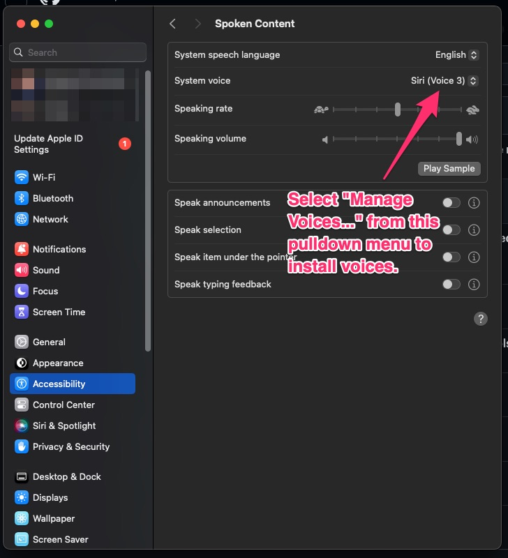
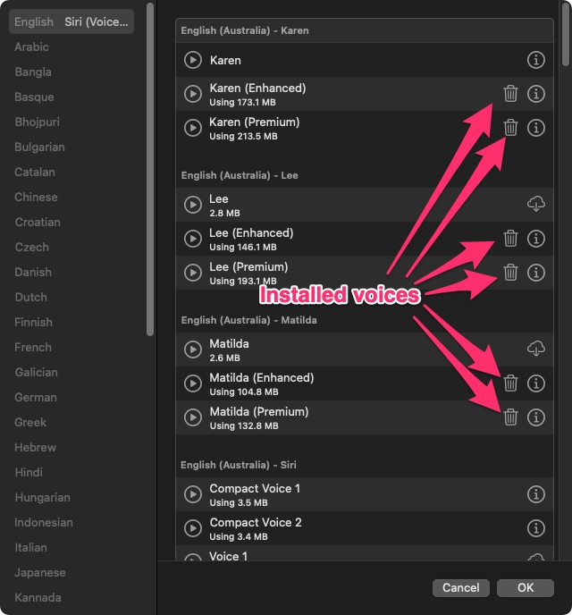
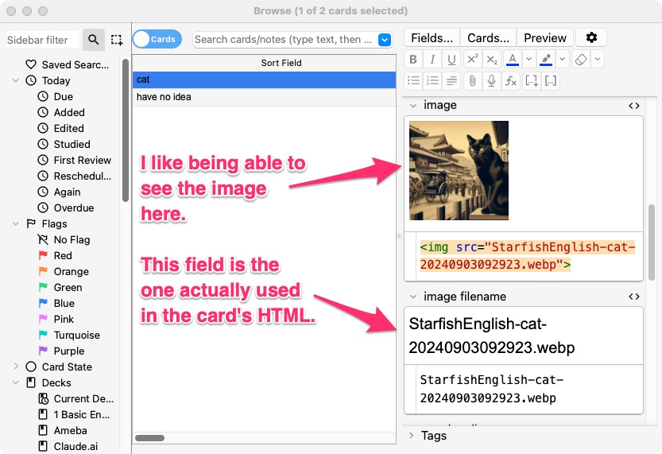
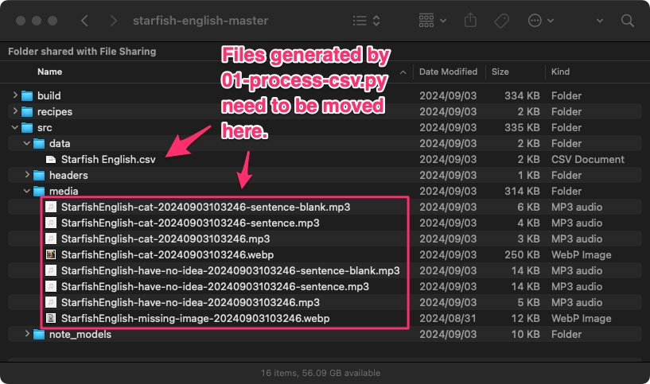

# Starfish English Anki Deck Maker

## This will only work on a Mac because the MP3 files are generated using Mac text-to-speech voices.

### Check you have the necessary voices installed

These are the English voices I've found best to use. The ones I commented out didn't pass muster. Some of them, I think the accent deviates too much from what Japanese JHS students are used to. (Don't blame me for a lack of diversity, blame the Japanese education system.)

```
VOICES = [
    "Allison (Enhanced)",
    "Ava (Premium)",
    "Daniel (Enhanced)",
    "Joelle (Enhanced)",
    "Lee (Enhanced)",
    "Karen (Premium)",
    "Kate (Enhanced)",
    "Matilda (Premium)",
    "Moira (Enhanced)",
    "Nathan (Enhanced)",
    "Oliver (Enhanced)",
    "Samantha (Enhanced)",
    "Serena (Premium)",
    "Stephanie (Enhanced)",
    "Susan (Enhanced)",
    "Tessa (Enhanced)",
    "Zoe (Premium)",
    #    "Evan (Enhanced)",
    #    "Fiona (Enhanced)",
    #    "Jamie (Premium)",
    #    "Isha (Premium)",
    #    "Rishi (Enhanced)",
    #    "Veena (Enhanced)",
]
```



In MacOS, go to System Settings --> Accessibility --> Spoken Content. Next to "System Voice" there's a pulldown menu. At the bottom of the menu, select "Manage Voices...". Make sure that the voices listed in the python script `scripts/01-process.python.py` are installed on your system. Stick with "Premium" or "Enhanced" voices and make sure they're easily understandable and don't mispronounces too many. (In the CSV file there's the column "sentence en pronunciation" that's used for TTS. It's there because sometimes you can get a word to be pronounced a little better by spelling it phonetically or creatively.)



### Optional: change the USERNAME variable in 01-process.py

The media files are renamed with a username and timestamp so they won't clash with media files in other decks. It's purely cosmetic, but you can change the username from `"StarfishEnglish"` to whatever you like.

### Set up the python environment

You'll need to have [Homebrew](https://brew.sh/) installed along with these packages:
- `brew install --cask miniconda`
- `brew install ffmpeg`
- `brew install imagemagick` (Maybe it's required? It doesn't hurt to have it.)

Create a conda environment

- `conda create --name brainbrew python=3.11 pillow`

Activate the environment.

- `conda activate brainbrew`

Install Brain Brew

- `pip install brainbrew`

That ought to do it for the required setup.

### Install CrowdAnki into Anki Desktop

[CrowdAnki ](https://ankiweb.net/shared/info/1788670778)is an Anki extension that exports decks as a JSON file with an accompanying folder of media. However, it's not easy to edit, so that's why we use [Brain Brew](https://github.com/ohare93/brain-brew).

### Let's make a deck!

#### Process the CSV file

The CrowdAnki export of the sample `Starfish English` deck is in the `starfish-english-master` folder. The first step is to run `brainbrew init` on it.

- `cd starfish-english-master`
- `brainbrew init Starfish_English`

This will create three new folders: `build`, `recipes`, and `source`.

The source directory contains some files we're going to replace:

```
- src/data/Starfish English.csv
- src/data/media/*.wep
```

Let's pretend we're going to use the Starfish English deck as a template to create a new deck. To do that, we need to create a CSV file that has only these columns:

- word en
- word ja
- sentence ja
- sentence en
- image

The final deck will have these columns. The script `01-process-csv.py` will generate the new columns (in italics) and their values:

- *guid*
- word en
- word ja
- sentence ja
- sentence en
- sentence en pronunciation
- *example*
- *example cloze*
- image
- *image filename*
- *word audio*
- *word audio filename*
- *sentence en audio*
- *sentence en audio filename*
- *sentence en blank audio*
- *sentence en blank audio filename*
- *tags*

In cause you're curious, the reason why each media file is listed twice is because the first column is what Brain Brew needs to recognize that the files exist and the second one is the field that's actually used in the HTML for the card. I don't like how by default Anki autoplays audio files, so instead I put media players on the cards. And I like to be able to see the image in the list of fields when I "browse" decks in Anki.



The CSV file that was originally used to create that deck (Starfish_English.csv) is in the `scripts` folder. The file has the bare minimum of columns:
- word en
- word ja
- sentence ja
- sentence en
- image

All the other columns are created and populated by the python script `01-process-csv.py`, which we'll run next.

```
cd scripts
python 01-process-csv.py "Starfish English.csv"
```

The script `01-process-csv.py` will:
1.  Back up the CSV file and add a timestamp to the backup's filename. (e.g. `Starfish English-old-20240903103246.csv`)
2. Generate the MP3s, process the images in the `images` folder, and place everything in a `media` folder with the name of the CSV file appended to it. (e.g. `media-Starfish_English`)
3. Create a new CSV file to replace the one you ran the script on.

### Set up Brain Brew to build the CrowdAnki deck

Now that the `01-process-tsv.py` script has created the CSV, MP3 and WEBP files, we need to move them into the `starfish-english-master` folder.

Move the MP3 and WEBP files that are in `/script/media-Starfish_English/` into `starfish-english-master/src/media/`

Move the CSV file generated by the script into `starfish-english-master/src/data/` Make sure it's named `Starfish English.csv` not `Starfish_English.csv` with an underscore.



Run brainbrew inside `starfish-english-master`:

`brainbrew run recipes/source_to_anki.yaml`

### Change the "crowdanki_uuid" in deck.json

This last step makes the deck you just created unique from the deck we used as a template. If you don't do this, when you import the deck into Anki, the cards will be added to the "Startfish English" deck instead of making a new deck.

in scripts run `python 02-create-uuid.py`. Open `starfish-english-master/src/build/Starfish_English/deck.json` in a text editor and replace ONLY line 4. There are other UUIDs that need to be left alone.

The CrowdAnki deck you'll import into Anki is in `starfish-english-master/src/build/Starfish_English/`

In Anki, go to "File --> CrowdAnki: Import From Disk", navigate to `starfish-english-master/build/Starfish_English/` and click the Open button in the Finder window.

### Change the name of the deck

If you want to change the deck's name, in `build/Starfish_English/deck.json`, change the line `"name": "Starfish English"`  on around line 233.

Sorry, I can't think of a less hacky way to change the UUID and name.

Anyway, DONE!

### Any Questions?

I don't have much time to answer questions or offer support, but fire away anyway.